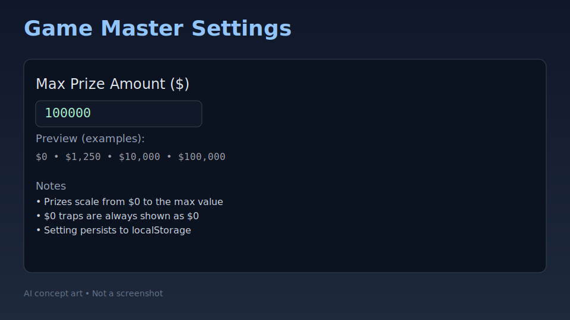
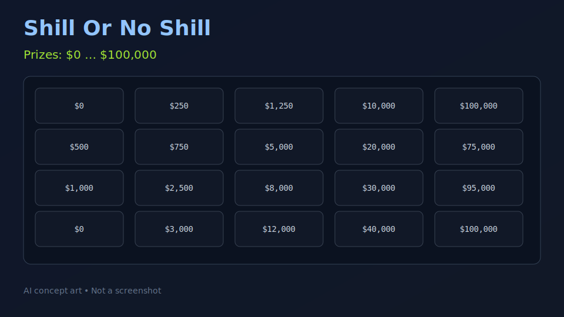

# Shill Or No Shill


A lightweight, offline-friendly game inspired by Deal or No Deal. Configure prizes, play rounds, and experiment with strategies. Now featuring a Max Prize Amount model: prizes scale from $0 up to your configured maximum, with $0 traps always shown as $0.

## Highlights
- Max Prize Amount setting replaces legacy "Prize Scale Multiplier".
- Prizes auto-scale from $0 to your chosen maximum; zero traps are forced to $0.
- Settings persist locally via `localStorage` and can be overridden per game.
- Runs in a web browser or as a Windows desktop app via Electron.

## Quick Start

### Run in your browser (local)
1. Open a terminal in the project root.
2. Start a simple server:
   - `npx http-server -p 8080`
3. Open:
   - Settings: `http://127.0.0.1:8080/game-master-settings.html`
   - Game: `http://127.0.0.1:8080/deal-or-no-deal.html`

### Windows desktop app (Electron)
Prerequisites: Node.js 18+, Git (optional), Windows 10/11.

- Install dependencies: `npm install`
- Start the app: `npm run start`
- Build installer: `npm run build`
  - The build uses electron-builder and the configuration in `package.json`.
- Publish a release (optional): `npm run release`
  - Requires `GITHUB_TOKEN` in your environment with repo publish permissions.

### Download (Releases)
Check the latest installers on GitHub Releases:
https://github.com/Snapwave333/Shillornoshill/releases

## Gameplay & Configuration

### Max Prize Amount
- Open `game-master-settings.html`.
- Set "Max Prize Amount ($)" — examples preview update automatically (e.g., $0, $1,250, $10,000, $100,000).
- Persisted to `localStorage` under `gameSettings.maxPrizeAmount`.
- The game page (`deal-or-no-deal.html`) uses this value to generate prize cases from $0 up to the max.
- Zero-amount traps are rendered as `$0`.
- The Game page does not include a "Max Prize" input; configure the amount exclusively in Game Master Settings.

### How prizes are generated
- Values are distributed from $0 up to `maxPrizeAmount` using an exponential spread for a satisfying curve.
- Traps that would be negative or zero are normalized to `$0`.
- Legacy `prizeScaleMultiplier` is removed; `maxPrizeAmount` is the single source of truth.

## Tutorials

### 1) Classic Play
1. Set `Max Prize Amount ($)` on the Settings page.
2. Click "Save Settings".
3. Open the Game page and start a new round.
4. Make selections, review offers, and decide: Deal or No Deal.

### 2) Custom one-off session
1. Open the Settings page and set "Max Prize Amount ($)" to your desired value.
2. Click "Save Settings", then start a new game. The Game page will use the saved value.

### 3) Designer mode (optional)
- Want a different distribution curve (e.g., more mid-tier values)?
- Open `deal-or-no-deal.html` and adjust the prize generation function accordingly.
- Keep `$0` traps enforced for clarity.

## Developer Guide

### Project Structure
```
.
├── deal-or-no-deal.html          # Game page
├── game-master-settings.html     # Settings page (includes Max Prize)
├── electron/main.js              # Electron app entrypoint
├── build/                        # App icons and assets
├── scripts/                      # Utilities (icon generation, backups)
├── assets/                       # Branding & extracted images
│   └── extracted/images/         # Concept art and visuals for README
├── backups/                      # Snapshots/originals (excluded from build)
├── package.json                  # Scripts & electron-builder config
└── README.md                     # This doc
```

### Scripts
- `npm run start` — Launch Electron app.
- `npm run build` — Build Windows installer via electron-builder.
- `npm run release` — Build and publish a release to GitHub (requires `GITHUB_TOKEN`).
- `npm run icons` — Generate application icons from `build/icon.png`.

### Build & Publish Notes
- electron-builder is configured to publish to `Snapwave333/Shillornoshill`.
- Large binaries should use Git LFS or be attached to Releases instead of tracked in Git.
- Build artifacts like `*.zip` are excluded from packaged app via electron-builder `files` config.

## AI-generated media
- The banner/logo (`hill-or-no-shill-logo.png`) and concept art may be AI-generated.
- You can add more AI-generated images under `assets/extracted/images/` and reference them in this README or in the UI.
- Suggestions:
  - Gameplay storyboard images
  - Case/prize concept art
  - Themed backgrounds

### Asset prompts and specs
See `assets/ai/prompts.md` for standardized prompts, sizes, and filenames for:
- Backgrounds (Game/Settings),
- Banker portrait,
- 26 numbered briefcases,
- UI icons (start, settings, restart, banker, offer),
- Logo variants.

Placeholder assets are already checked in under `assets/images/` so you can preview layout before replacing them with your generated images.

### Screenshots & Concept Art
Below are AI-styled concept visuals that illustrate the app screens:

Settings (concept):



Game (concept):



## Troubleshooting
- Blank page in Electron: run `npm install`, then `npm run start`.
- Windows SmartScreen: click "More info" → "Run anyway" for unsigned builds.
- Large file warnings on push: configure Git LFS for big binaries (https://git-lfs.github.com) or add them to Releases.
- Port 8080 in use: change port `npx http-server -p 8081`.

## Roadmap
- Curve editor for prize distributions.
- Session analytics and visualization.
- In-app settings panel for Electron build.

## Contributing
PRs welcome! Please open an issue with proposed changes. Follow conventional commit messages when possible.

## License
MIT © Snapwave333